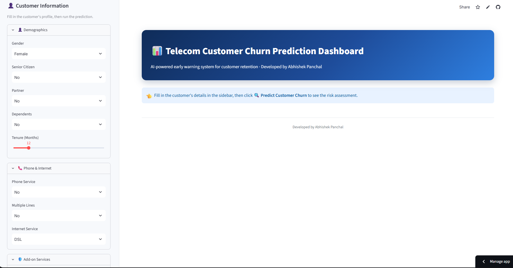
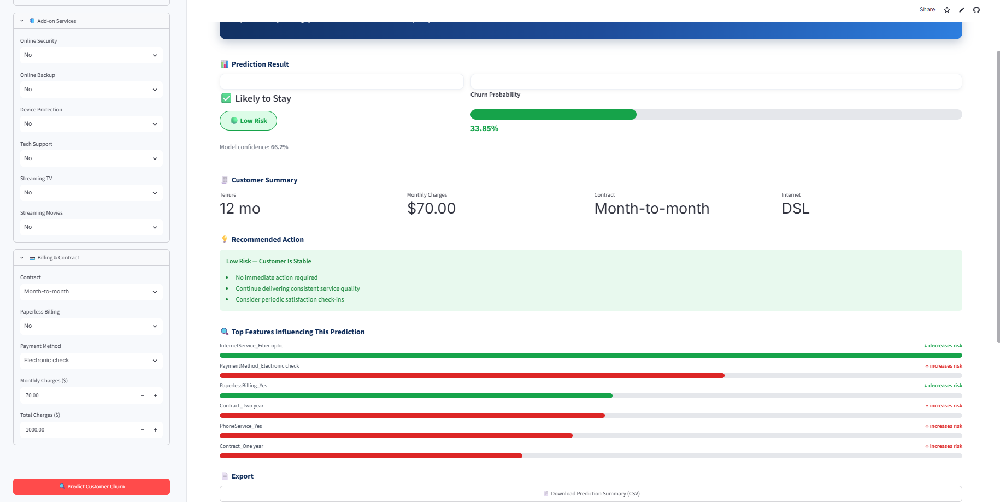

# 📊 Telecom Customer Churn Prediction Dashboard

An AI-powered web application that predicts whether a telecom customer is likely to churn using a trained **XGBoost Machine Learning model**. The application provides an interactive dashboard, customer risk assessment, feature explainability, and personalized retention recommendations.


[](https://telecom-customer-churn-app-mcp5nhwrn3nhjzptjdoe2o.streamlit.app/)

An AI-powered web application that predicts telecom customer churn using a trained XGBoost Machine Learning model.


##  Project Overview

Customer churn is one of the biggest challenges faced by telecom companies. Retaining an existing customer is significantly more cost-effective than acquiring a new one.

This project uses Machine Learning to identify customers who are likely to leave the company, allowing businesses to take proactive retention measures.


##  Features

-  Predict customer churn using a trained XGBoost model
-  Interactive Streamlit dashboard
-  Displays churn probability with confidence score
-  Risk classification (Low, Medium, High)
-  Personalized customer retention recommendations
-  SHAP-based feature importance explanation
-  Customer profile summary
-  Download prediction results as CSV
-  Professional and responsive user interface
-  Fast predictions using cached model loading


##  Technologies Used

- Python
- Streamlit
- Pandas
- NumPy
- Scikit-learn
- XGBoost
- SHAP
- Joblib
- Matplotlib


##  Machine Learning Workflow

1. Data Cleaning & Preprocessing
2. Exploratory Data Analysis (EDA)
3. Feature Engineering
4. Data Encoding
5. Model Training
6. Hyperparameter Tuning
7. Model Evaluation
8. Deployment using Streamlit


##  Future Enhancements

- Customer segmentation
- Batch CSV prediction
- PDF report generation
- Email alert integration
- Cloud database integration
- User authentication
- Model retraining pipeline


##  Developer

**Abhishek Panchal**


## 🌐 Live Demo

🚀 **Live Streamlit Application**

https://telecom-customer-churn-app-mcp5nhwrn3nhjzptjdoe2o.streamlit.app/

Explore the interactive dashboard to:
- Predict customer churn
- View churn probability and risk level
- Get AI-powered retention recommendations
- Understand predictions using SHAP feature importance
- Download prediction summaries


## 📸 Application Screenshots

### 🏠 Dashboard



### 📈 Feature Importance



## 🚀 Run Locally

```bash
git clone https://github.com/AbhishekPanchal008/Telecom-Customer-Churn-App.git

cd Telecom-Customer-Churn-App

pip install -r requirements.txt

streamlit run Telecom-Customer-Churn-App/app.py
```


##  License

This project is developed for educational and learning purposes.
